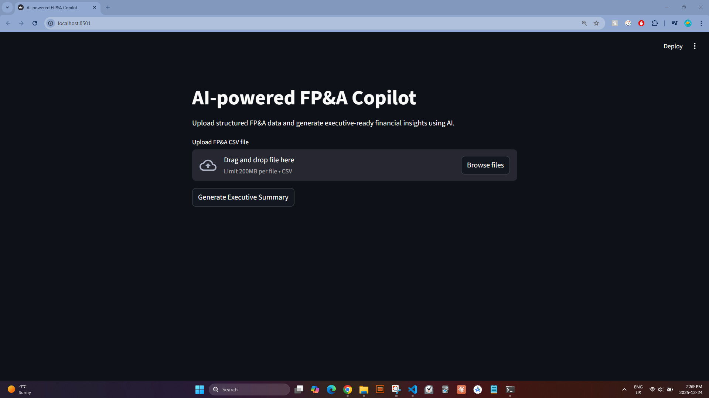
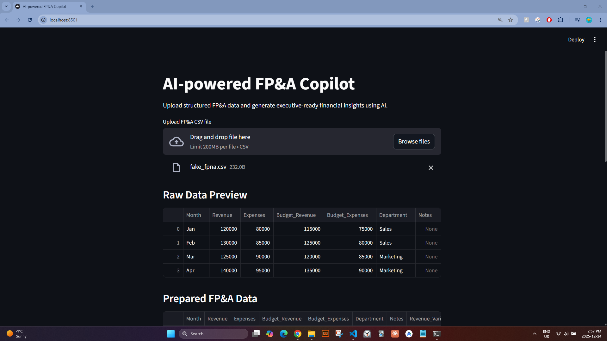
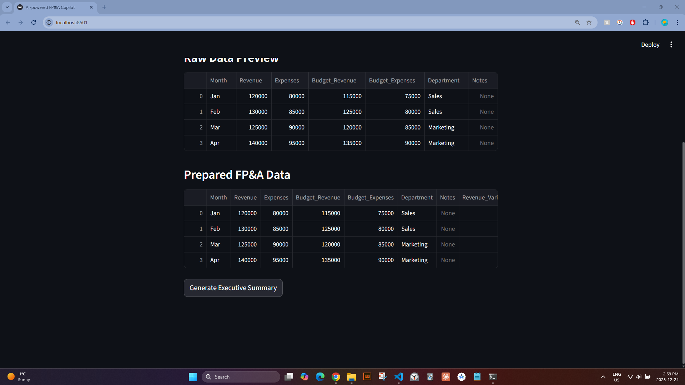
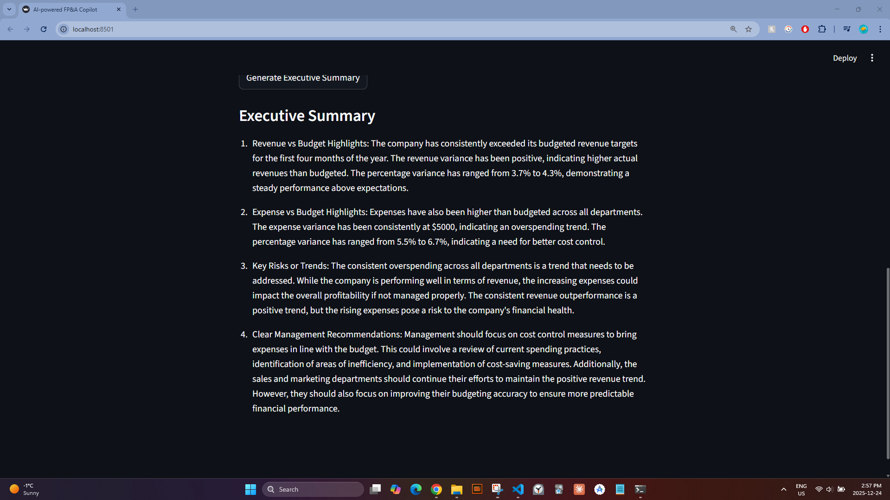

# AI-powered FP&A Copilot
TL;DR: Accelerates finance reporting by converting raw credit card and FP&A data into executive-ready summaries in minutes, improving speed, consistency, and traceability of insights using AI.

## Demo

Below is a short walkthrough of the AI-powered FP&A Copilot:

1. Upload a structured FP&A-style CSV file  
2. Review parsed financial data in the interface  
3. Generate an executive-ready financial summary using AI  


### Step 1: Landing Page


### Step 2: Upload CSV


### Step 3: Generate Executive Summary


### Step 4: Executive Summary Output



## Problem Statement

Finance teams spend significant time translating raw financial data into executive-ready insights. While reporting outputs are often accurate, they frequently lack clear narrative context, consistent explanations, and decision-oriented framing.

This creates several challenges:
- Manual variance explanations and commentary are time-consuming
- Insights vary in quality and consistency across analysts
- Leadership consumes summaries without direct traceability to underlying data
- Finance teams spend more time explaining results than analyzing drivers

As large language models mature, there is an opportunity to augment FP&A workflows by transforming structured financial data into clear, reliable, and repeatable executive-level summaries.
This is clean Markdown:

## Solution Overview

The AI-powered FP&A Copilot is a lightweight prototype that demonstrates how large language models can be integrated into finance workflows to generate executive-ready financial summaries from structured data.

The solution follows a simple, end-to-end flow:

1. **User uploads structured financial data**  
   A CSV file containing financial metrics (e.g., actuals, budget, variances) is uploaded through a Streamlit interface.

2. **Data is parsed and structured for analysis**  
   The application reads the uploaded data into a structured DataFrame, ensuring it is formatted consistently for downstream processing.

3. **Prompt-driven financial summarization**  
   A carefully designed prompt passes the structured financial data to a large language model, instructing it to generate:
   - High-level performance summary  
   - Key variance drivers  
   - Risks and areas requiring attention  

4. **Executive-ready output**  
   The generated narrative is returned in natural language, optimized for senior leadership consumption and suitable for use in management reporting or presentations.

This prototype focuses on a single “happy path” — from data upload to insight generation — prioritizing clarity, reliability, and explainability over feature completeness.

## Key Features

- **CSV-based financial input**  
  Supports structured FP&A-style data uploads, enabling rapid testing with real or synthetic financial datasets.

- **LLM-powered executive summarization**  
  Converts structured financial metrics into concise, executive-ready narratives using prompt-driven large language models.

- **Finance-aware prompt design**  
  Prompts are explicitly structured to emphasize performance drivers, variances, and risks, mirroring real FP&A workflows.

- **Interactive Streamlit interface**  
  Simple UI allowing users to upload data, review inputs, and generate insights without technical setup.

- **Explainable, non-black-box output**  
  Outputs are deterministic in structure and optimized for clarity, making the insights easy to audit and communicate.

- **Prototype-first architecture**  
  Designed as an exploratory product to demonstrate feasibility, product thinking, and AI integration rather than production scale.

## Architecture & Tech Stack

### High-Level Architecture

The FP&A Copilot follows a simple, end-to-end pipeline designed around a single “happy path” from data ingestion to executive insight generation:

1. **User Interface (Streamlit)**  
   - User uploads a structured FP&A-style CSV file  
   - User triggers insight generation via a single action  

2. **Data Processing Layer (Python / Pandas)**  
   - Uploaded data is validated and loaded into a Pandas DataFrame  
   - Core financial metrics (variance, trends, KPIs) are prepared for summarization  

3. **LLM Interface**  
   - Structured financial context is passed to a large language model via API  
   - Carefully designed prompts ensure finance-appropriate tone, clarity, and reliability  

4. **Insight Output**  
   - The model returns an executive-ready narrative summary  
   - Output is displayed directly in the UI and can be exported if needed  

This architecture intentionally prioritizes clarity, interpretability, and speed over complexity.

---

### Tech Stack

**Frontend / UI**
- Streamlit – Lightweight web interface for rapid prototyping and demoability  

**Data & Analytics**
- Python  
- Pandas – Structured financial data manipulation and aggregation  

**AI / LLM**
- OpenAI API (LLM) – Natural language generation for executive summaries  
- Prompt design focused on financial accuracy, consistency, and explainability  

**Project Structure**
- Modular Python scripts separating:
  - Data preparation  
  - LLM interaction  
  - Application orchestration  
- Designed to be easily extended or refactored into a production-grade service  

---

### Design Philosophy

- **Single happy path**: optimize for one clear, working user flow  
- **Human-readable outputs**: prioritize executive clarity over raw model capability  
- **Prototype-first**: built to demonstrate applied AI thinking and product judgment rather than production-scale infrastructure

## Scope & Limitations

**What this is**
- A functional prototype demonstrating AI integration in FP&A workflows
- An example of prompt-driven financial insight generation
- A product-thinking exercise focused on clarity and reliability

**What this is not**
- A production-grade financial system
- A replacement for existing FP&A tooling
- A model-training or ML infrastructure project

## Running the App Locally

```bash
pip install -r requirements.txt
streamlit run app.py
